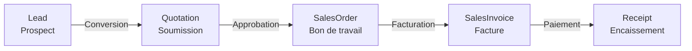

# Chapitre 5 — Catalogue des ModelCodes SEIGMA

> **Version documentée** : 1.0.0 | **Sources** : PDFs officiels SEIGMA + tests de production
> **Dernière mise à jour** : 2026-06-20
>
> 📋 **Catalogue exhaustif basé sur `/mod-mgt`** (compte administrateur SEIGMA, 2026-06-20). Tous les `totalCount` sont vérifiés via l'API. **155 modules** découverts, **~140 fonctionnels** (HTTP 200), **~15 cassés** (HTTP 500).
>
> 🚧 **À compléter** : Tous les chiffres d'enregistrements (~589, ~1935, etc.) sont basés sur une instance de référence en juin 2026. Ces nombres **varient considérablement** selon votre instance SEIGMA. Utilisez-les uniquement comme ordre de grandeur. Les ReferenceId de référentiels (PaymentTerm, Warehouse, etc.) sont également spécifiques à chaque instance.

---

## Table des matières

1. [Aperçu général](#aperçu-général)
2. [Pipeline VENTES](#pipeline-ventes)
   - [Lead — Prospects](#lead--prospects)
   - [Quotation — Soumissions](#quotation--soumissions)
   - [SalesOrder — Bons de travail](#salesorder--bons-de-travail)
   - [SalesInvoice — Factures de vente](#salesinvoice--factures-de-vente)
   - [Receipt — Encaissements](#receipt--encaissements)
3. [Module CLIENTS](#module-clients)
   - [Customer — Clients](#customer--clients)
4. [Module CALLS/BILLETS](#module-callsbillets)
   - [Call — Billets](#call--billets)
5. [Module PRODUITS](#module-produits)
   - [Product — Produits](#product--produits)
6. [Référentiels](#référentiels)
   - [PaymentTerm — Conditions de paiement](#paymentterm--conditions-de-paiement)
   - [Warehouse — Entrepôts](#warehouse--entrepôts)
7. [Endpoints cassés](#endpoints-cassés)
8. [Matrice récapitulative](#matrice-récapitulative)
9. [Catalogue exhaustif (155 modules)](#catalogue-exhaustif-155-modules)
10. [Schéma des relations](#schéma-des-relations)

---

## Aperçu général

Ce chapitre catalogue **tous les ModelCodes** utilisables avec l'API Reference SEIGMA (`GET /api/reference/{ModelCode}/{id}` et `POST /api/reference/{ModelCode}/search`).

Chaque fiche-modèle documente :
- Le **ModelCode** exact à utiliser dans les URLs
- Le **nom affiché** dans l'interface SEIGMA
- Le **format du Display** (pour identifier visuellement les enregistrements)
- Le **nombre d'enregistrements** (indicatif, dépend de l'instance)
- Les **endpoints fonctionnels** (GET/search) et leur statut
- Les **endpoints d'écriture** (POST/PUT) s'ils sont testés
- Les **champs notables** (5–10 plus importants)
- Les **relations** (FK vers d'autres modèles)
- Les **quirks spécifiques** (⚠️ pièges, limitations, comportements inattendus)

> **Note** : Les comptes d'enregistrements sont basés sur une instance SEIGMA de référence en juin 2026. Ils varient selon l'instance.

---

## Pipeline VENTES



---

### Lead — Prospects

| Propriété | Valeur |
|-----------|--------|
| **ModelCode** | `Lead` |
| **Nom affiché** | Prospects |
| **Format Display** | `LE-XXXXX` |
| **Enregistrements** | ~589 |
| **GET /{id}** | ✅ Fonctionnel — 49 champs |
| **POST /search** | ✅ Fonctionnel |
| **POST (création)** | ❓ Non testé |
| **PUT (modification)** | ❓ Non testé |
| **SelectAttributes** | ✅ Supporté (search) |

**Champs notables :**

| Champ | Type | Description |
|-------|------|-------------|
| `Display` | string | Format `LE-XXXXX` |
| `Name` | string | Nom du prospect |
| `Email` | string | Courriel |
| `Phone` | string | Téléphone |
| `Mobile` | string | Mobile |
| `EstimatedRevenue` | decimal | Revenu estimé |
| `ProbabilityPercentage` | decimal | Probabilité de conversion (%) |
| `ExpectedClosingDate` | datetime | Date de fermeture prévue |
| `Description` | string | Description/notes |

**Relations (FK) :**

| FK | Cible | Description |
|----|-------|-------------|
| `CustomerId` | Customer | Client lié (si converti) |
| `LeadStatusId` | LeadStatus | Statut (Nouveau, Qualifié, etc.) |
| `LeadSourceId` | LeadSource | Source du lead |
| `SalesTypeId` | SalesType | Type de vente |
| `TerritoryId` | Territory | Territoire |
| `AssignedToId` | User | Commercial assigné |

**⚠️ Quirks :**
- Aucun quirks bloquant détecté. Modèle stable.

---

### Quotation — Soumissions

| Propriété | Valeur |
|-----------|--------|
| **ModelCode** | `Quotation` |
| **Nom affiché** | Soumissions |
| **Format Display** | `QU-XXXXX` |
| **Enregistrements** | ~1935 |
| **GET /{id}** | ✅ Fonctionnel — 74 champs |
| **POST /search** | ✅ Fonctionnel |
| **POST (création)** | ❓ Non testé |
| **PUT (modification)** | ❓ Non testé |
| **SelectAttributes** | ✅ Supporté (search) |

**Champs notables :**

| Champ | Type | Description |
|-------|------|-------------|
| `Display` | string | Format `QU-XXXXX` |
| `SubTotal` | decimal | Sous-total |
| `Total` | decimal | Total |
| `TaxGST` | decimal | TPS |
| `TaxPST` | decimal | TVQ |
| `Balance` | decimal | Solde dû |
| `DiscountPercentage` | decimal | Rabais (%) |
| `DiscountAmount` | decimal | Montant du rabais |
| `TotalToBill` | decimal | Montant à facturer |

**Relations (FK) :**

| FK | Cible | Description |
|----|-------|-------------|
| `CustomerId` | Customer | Client |
| `LeadId` | Lead | Lead d'origine |
| `QuotationStatusId` | QuotationStatus | Statut (Brouillon, Envoyée, Acceptée, etc.) |
| `SalesTypeId` | SalesType | Type de vente |
| `PaymentTermId` | PaymentTerm | Conditions de paiement |
| `TerritoryId` | Territory | Territoire |
| `AssignedToId` | User | Assigné à |
| `ShippingAddressId` | Address | Adresse de livraison |
| `BillingAddressId` | Address | Adresse de facturation |

**⚠️ Quirks :**
- Aucun quirks bloquant détecté. SelectAttributes résout correctement `CustomerId` et `QuotationStatusId`.

---

### SalesOrder — Bons de travail

| Propriété | Valeur |
|-----------|--------|
| **ModelCode** | `SalesOrder` |
| **Nom affiché** | Bons de travail |
| **Format Display** | `WO-XXXXX` (ex: `WO-01807`) |
| **Enregistrements** | ~1932 |
| **GET /{id}** | ✅ Fonctionnel — 87 champs |
| **POST /search** | ✅ Fonctionnel — 23 champs |
| **POST (création)** | ✅ Fonctionnel — 201 Created |
| **PUT (modification)** | ✅ Fonctionnel — 200 OK |
| **SelectAttributes** | ✅ Supporté (search) |

**Champs notables :**

| Champ | Type | Description |
|-------|------|-------------|
| `Display` | string | Format `WO-XXXXX` |
| `SubTotal` | decimal | Sous-total |
| `Total` | decimal | Total |
| `TaxGST` | decimal | TPS |
| `TaxPST` | decimal | TVQ |
| `Balance` | decimal | Solde dû |
| `TotalToBill` | decimal | Montant à facturer |
| `Description` | string | Description du travail |
| `RequiredSignatureCount` | int | Signatures requises |
| `CurrentActivitySubject` | string | Sujet de l'activité en cours |

**Relations (FK) :**

| FK | Cible | Description |
|----|-------|-------------|
| `CustomerId` | Customer | Client |
| `QuotationId` | Quotation | Soumission d'origine |
| `LeadId` | Lead | Lead d'origine |
| `SalesOrderStatusId` | SalesOrderStatus | Statut |
| `PaymentTermId` | PaymentTerm | Conditions de paiement |
| `WarehouseId` | Warehouse | Entrepôt |
| `TerritoryId` | Territory | Territoire |
| `AssignedToId` | User | Assigné à |

**Endpoints d'écriture :**

| Opération | Endpoint | Corps |
|-----------|----------|-------|
| Créer | `POST /api/reference/SalesOrder` | `{"Properties": {"CustomerId": {"ReferenceId":"..."}, "PaymentTermId": {"ReferenceId":"..."}, "WarehouseId": {"ReferenceId":"..."}, ...}` |
| Modifier | `PUT /api/reference/SalesOrder/{id}` | `{"Properties": {"Description": "Nouvelle description"}}` |

**Champs obligatoires pour création :**

| Champ | Format |
|-------|--------|
| `CustomerId` | `{"ReferenceId": "{un-id-de-reference-client}"}` |
| `PaymentTermId` | `{"ReferenceId": "{un-id-de-reference-paymentterm}"}` |
| `WarehouseId` | `{"ReferenceId": "{un-id-de-reference-warehouse}"}` |

> 🚧 **À compléter** : Les ReferenceId ci-dessus sont spécifiques à votre instance. Obtenez-les via `POST /api/reference/{ModelCode}/search` sur les modèles Customer, PaymentTerm et Warehouse.

**⚠️ Quirks :**
- **SalesOrderLine INACCESSIBLE** : Tous les endpoints `/api/reference/SalesOrderLine/*` retournent **HTTP 500**. Impossible de lire ou modifier les lignes de commande via l'API.
- Le search ne retourne que 23 champs ; pour les 87 champs, utiliser le GET par `ReferenceId`.
- Le `PUT` a un comportement **PATCH-like** : seuls les champs fournis sont modifiés.

---

### SalesInvoice — Factures de vente

| Propriété | Valeur |
|-----------|--------|
| **ModelCode** | `SalesInvoice` |
| **Nom affiché** | Factures |
| **Format Display** | Variable (numéro de facture) |
| **Enregistrements** | ~1019 |
| **GET /{id}** | ✅ Fonctionnel — 68 champs |
| **POST /search** | ✅ Fonctionnel — 14 champs par défaut |
| **POST (création)** | ✅ Fonctionnel — 201 Created |
| **PUT (modification)** | ❓ Non testé |
| **SelectAttributes** | ❌ **IGNORÉ** sur search |

**Champs obligatoires pour création :**

| Champ | Format |
|-------|--------|
| `CustomerId` | `{"ReferenceId": "{un-id-de-reference-client}"}` |
| `PaymentTermId` | `{"ReferenceId": "{un-id-de-reference-paymentterm}"}` |

> ⚠️ **WarehouseId N'EST PAS requis** pour SalesInvoice (contrairement à SalesOrder).

**Champs notables :**

| Champ | Type | Description |
|-------|------|-------------|
| `Display` | string | Numéro de facture |
| `SubTotal` | decimal | Sous-total |
| `Total` | decimal | Total |
| `TaxGST` | decimal | TPS |
| `TaxPST` | decimal | TVQ |
| `Balance` | decimal | Solde dû |
| `AmountPaid` | decimal | Montant payé |

**Relations (FK) :**

| FK | Cible | Description |
|----|-------|-------------|
| `SalesOrderId` | SalesOrder | Bon de travail lié |
| `QuotationId` | Quotation | Soumission liée |
| `CustomerId` | Customer | Client |
| `CustomerContactId` | CustomerContact | Contact client pour cette facture |
| `PaymentTermId` | PaymentTerm | Conditions de paiement |

**⚠️ Quirks :**

| Problème | Impact | Workaround |
|----------|--------|------------|
| **SelectAttributes IGNORÉ** | Tous les champs demandés via `SelectAttributes` sont ignorés silencieusement. Le search retourne toujours 14 champs fixes | Utiliser le GET par `ReferenceId` pour obtenir les 68 champs |
| **SalesOrderId absent du search** | Le champ `SalesOrderId` n'est pas inclus dans les résultats du search, même avec `SelectAttributes` | Récupérer le détail via `GET /api/reference/SalesInvoice/{id}` pour obtenir le `SalesOrderId` |

---

### Receipt — Encaissements

| Propriété | Valeur |
|-----------|--------|
| **ModelCode** | `Receipt` |
| **Nom affiché** | Encaissements |
| **Format Display** | `RE-XXXXX` |
| **Enregistrements** | ~925 |
| **GET /{id}** | ✅ Fonctionnel — 31 champs |
| **POST /search** | ✅ Fonctionnel |
| **POST (création)** | ✅ Fonctionnel — 201 Created |
| **PUT (modification)** | ❓ Non testé |
| **SelectAttributes** | ❌ **IGNORÉ** sur search |

**Champs obligatoires pour création :**

| Champ | Format |
|-------|--------|
| `CustomerId` | `{"ReferenceId": "{un-id-de-reference-client}"}` |
| `Amount` | `decimal` (ex: `500.00`) |
| `PaymentMethodId` | `{"ReferenceId": "{un-id-de-reference-paymentmethod}"}` ⚠️ **Obligatoire** |

> ⚠️ **PaymentMethodId est obligatoire** pour la création. Utilisez `POST /api/reference/PaymentMethod/search` pour obtenir les méthodes disponibles.

**Champs notables :**

| Champ | Type | Description |
|-------|------|-------------|
| `Display` | string | Format `RE-XXXXX` |
| `Amount` | decimal | Montant encaissé |
| `PaymentDate` | datetime | Date du paiement |
| `Reference` | string | Référence du paiement |
| `TransactionId` | string | ID de transaction |

**Relations (FK) :**

| FK | Cible | Description |
|----|-------|-------------|
| `CustomerId` | Customer | Client |
| `SalesInvoiceId` | SalesInvoice | Facture liée |
| `PaymentMethodId` | PaymentMethod | Mode de paiement |

**⚠️ Quirks :**

| Problème | Impact | Workaround |
|----------|--------|------------|
| **SelectAttributes IGNORÉ** | Identique à SalesInvoice : les `SelectAttributes` sont ignorés silencieusement | Utiliser le GET par `ReferenceId` |
| **SalesOrderId TRANSITIF** | Le `Receipt` ne référence pas directement le `SalesOrder`. La relation est `Receipt → SalesInvoice → SalesOrder`. Le `SalesOrderId` n'est **jamais résolu** en search | Résoudre manuellement : GET `/api/reference/SalesInvoice/{SalesInvoiceId}` puis GET `/api/reference/SalesOrder/{SalesOrderId}` |

```
Receipt ──(SalesInvoiceId)──→ SalesInvoice ──(SalesOrderId)──→ SalesOrder
                                                                   ↑
                                              JAMAIS résolu depuis Receipt/search
```

---

## Module CLIENTS

### Customer — Clients

| Propriété | Valeur |
|-----------|--------|
| **ModelCode** | `Customer` |
| **Nom affiché** | Clients |
| **Format Display** | Nom du client (texte libre) |
| **Enregistrements** | ~3839 |
| **GET /{id}** | ✅ Fonctionnel — 60 champs |
| **POST /search** | ✅ Fonctionnel |
| **POST (création)** | ❓ Non testé |
| **PUT (modification)** | ❓ Non testé |
| **SelectAttributes** | ✅ Supporté (search) |

**Champs notables :**

| Champ | Type | Description |
|-------|------|-------------|
| `Name` | string | Nom du client |
| `Display` | string | Nom affiché |
| `Email` | string | Courriel |
| `Phone` | string | Téléphone principal |
| `Mobile` | string | Mobile |
| `Phone2` | string | Téléphone secondaire |
| `ContactName` | string | Nom du contact |
| `Description` | string | Notes |
| `Warning` | string | Avertissement |
| `CustomerBalance` | decimal | Solde client |
| `CreditRemaining` | decimal | Crédit restant |
| `CreditUsed` | decimal | Crédit utilisé |

**Relations (FK) — 14+ clés étrangères :**

| FK | Cible | Description |
|----|-------|-------------|
| `PaymentTermId` | PaymentTerm | Conditions de paiement |
| `TaxCodeId` | TaxCode | Code de taxe |
| `TerritoryId` | Territory | Territoire |
| `LeadSourceId` | LeadSource | Source du lead |
| `LanguageId` | Language | Langue |
| `ContactMethodId` | ContactMethod | Méthode de contact |
| `CustomerClassId` | CustomerClass | Classe client |
| `ShippingCountryId` | Country | Pays de livraison |
| `ShippingCountryStateId` | CountryState | Province/État de livraison |
| `BillingCountryId` | Country | Pays de facturation |
| `BillingCountryStateId` | CountryState | Province/État de facturation |
| `ParentCustomerId` | Customer | Client parent |
| `AffiliateId` | Affiliate | Affilié |

**Adresses (champs scalaires) :**

| Groupe | Champs |
|--------|--------|
| Livraison | `ShippingStreet`, `ShippingStreet2`, `ShippingCity`, `ShippingPostalCode`, `ShippingName`, `IsShippingSameAsBilling` |
| Facturation | `BillingStreet`, `BillingStreet2`, `BillingCity`, `BillingPostalCode`, `BillingName` |

**⚠️ Quirks :**
- Aucun quirks bloquant détecté. Modèle le plus riche en relations (14+ FK).
- Les champs `IsActive`, `IsAutomaticQuotation`, `IsQuotationNotification`, etc. sont des strings (`"True"`/`"False"`), pas des booléens.

---

## Module CALLS/BILLETS

### Call — Billets

| Propriété | Valeur |
|-----------|--------|
| **ModelCode** | `Call` |
| **Nom affiché** | Billets |
| **Format Display** | `TI-XXXXX` (ex: `TI-00097`) |
| **Enregistrements** | ~95 |
| **GET /{id}** | ✅ Fonctionnel — 36 champs |
| **POST /search** | ✅ Fonctionnel — 22 champs |
| **POST (création)** | ❓ Non testé |
| **PUT (modification)** | ❓ Non testé |
| **SelectAttributes** | ✅ Supporté (search) — 4 références résolues |

**Champs notables :**

| Champ | Type | Description |
|-------|------|-------------|
| `Display` | string | Format `TI-XXXXX` |
| `Name` | string | Nom du billet (ex: « SYLVIE PLANTE - TEAM JOY ») |
| `Description` | string | Description courte |
| `WorkDescription` | string | Description détaillée du travail (**HTML encodé** : `&#39;`, `<br />`) |
| `CallStatusId` | objet | Statut (Ouvert, Fermé, etc.) + Color |
| `CallTypeId` | objet | Type (Correction client, etc.) |
| `PriorityId` | objet | Priorité (Élevé, Normal, etc.) |
| `Phone` | string | Téléphone |
| `Mobile` | string | Mobile |

**Relations (FK) :**

| FK | Cible | Description |
|----|-------|-------------|
| `CallStatusId` | CallStatus | Statut du billet |
| `CallTypeId` | CallType | Type de billet |
| `PriorityId` | Priority | Priorité |
| `AssignedToId` | User | Employé assigné |
| `CustomerId` | Customer | Client lié |
| `SalesOrderId` | SalesOrder | **Bon de travail lié** (ex: WO-01013) |

**⚠️ Quirks :**

| Problème | Impact | Workaround |
|----------|--------|------------|
| **WhereCondition par `SalesOrderId` → 500** | Toute recherche filtrant sur `SalesOrderId` crash avec une erreur SQL Server : `"The multi-part identifier dbo.CallView.SalesOrder.Display_2 could not be bound."` | Récupérer tous les Calls sans filtre, puis filtrer côté client sur `SalesOrderId.ReferenceId` |
| **`WorkDescription` en HTML** | Le champ contient des entités HTML (`&#39;`, `<br />`, `&nbsp;`, `&amp;`) | Toujours décoder avec `decodeHtml()` avant affichage |
| **`SalesOrderId` absent du search** | Même avec `SelectAttributes`, le `SalesOrderId` n'est pas retourné en search | Utiliser `GET /api/reference/Call/{id}` pour obtenir le `SalesOrderId` complet |
| **SelectAttributes partiel** | 4 champs résolus (`CallStatusId`, `CallTypeId`, `PriorityId`, `AssignedToId`) mais `SalesOrderId`, `WorkDescription`, `CustomerId` absents | Pour ces 3 champs, passer par le GET détail |

---

## Module PRODUITS

### Product — Produits

| Propriété | Valeur |
|-----------|--------|
| **ModelCode** | `Product` |
| **Nom affiché** | Produits |
| **Format Display** | Nom du produit |
| **Enregistrements** | ~21 |
| **GET /{id}** | ✅ Fonctionnel — 27 champs |
| **POST /search** | ✅ Fonctionnel |
| **POST (création)** | ❓ Non testé |
| **PUT (modification)** | ❓ Non testé |
| **SelectAttributes** | ✅ Supporté (search) |

**Champs notables :**

| Champ | Type | Description |
|-------|------|-------------|
| `Name` | string | Nom du produit (ex: « Lavage de vitres extérieur ») |
| `Display` | string | Nom affiché |
| `Price` | decimal | Prix unitaire |
| `Cost` | decimal | Coût |
| `Description` | string | Description |

**Relations (FK) :**

| FK | Cible | Description |
|----|-------|-------------|
| `ProductCategoryId` | ProductCategory | Catégorie |
| `ProductTypeId` | ProductType | Type de produit |

**⚠️ Quirks :**

| Problème | Impact | Note |
|----------|--------|------|
| **Tous les prix à 0.0** | Les champs `Price` et `Cost` sont à `0.0` pour tous les produits | Le prix réel est dans `SubTotal`/`Total` du `SalesOrder`. Les produits sont utilisés comme templates, pas comme catalogue de prix. |

---

## Référentiels

### PaymentTerm — Conditions de paiement

| Propriété | Valeur |
|-----------|--------|
| **ModelCode** | `PaymentTerm` |
| **Nom affiché** | Conditions de paiement |
| **Format Display** | Texte (ex: « NET 45 », « SUR RÉCEPTION ») |
| **Enregistrements** | 4 |
| **GET /{id}** | ✅ Fonctionnel — 15 champs |
| **POST /search** | ✅ Fonctionnel |
| **POST (création)** | ❓ Non testé |
| **PUT (modification)** | ❓ Non testé |
| **SelectAttributes** | ✅ Supporté |

**Valeurs connues (exemple — spécifiques à l'instance) :**

| Display | ReferenceId |
|---------|-------------|
| SUR RÉCEPTION | `{un-id-de-reference}` |
| NET 45 | `{un-id-de-reference}` |
| NET 365 | `{un-id-de-reference}` |
| (4ᵉ terme) | `{un-id-de-reference}` |

> 🚧 **À compléter** : Les ReferenceId des PaymentTerms sont spécifiques à votre instance. Obtenez-les via `POST /api/reference/PaymentTerm/search`.

**⚠️ Quirks :**
- Aucun. Petit modèle stable, 4 enregistrements seulement.

---

### Warehouse — Entrepôts

| Propriété | Valeur |
|-----------|--------|
| **ModelCode** | `Warehouse` |
| **Nom affiché** | Entrepôts |
| **Format Display** | « Principal » |
| **Enregistrements** | 1 |
| **GET /{id}** | ✅ Fonctionnel |
| **POST /search** | ✅ Fonctionnel |
| **POST (création)** | ❓ Non testé |
| **PUT (modification)** | ❓ Non testé |
| **SelectAttributes** | ✅ Supporté |

**Valeur connue (exemple — spécifique à l'instance) :**

| Display | ReferenceId |
|---------|-------------|
| Principal | `{un-id-de-reference}` |

> 🚧 **À compléter** : Le ReferenceId de l'entrepôt est spécifique à votre instance. Obtenez-le via `POST /api/reference/Warehouse/search`.

**⚠️ Quirks :**
- Un seul entrepôt. Requis pour la création de `SalesOrder`.

---

### Employee — Employés

| Propriété | Valeur |
|-----------|--------|
| **ModelCode** | `Employee` |
| **Nom affiché** | Employés |
| **Format Display** | Nom de l'employé |
| **Enregistrements** | ~0 (compte Web non-admin) |
| **GET /{id}** | ❓ Non testé |
| **POST /search** | ✅ Fonctionnel — 0 résultat pour utilisateur Web |
| **POST (création)** | ❓ Non testé |
| **PUT (modification)** | ❓ Non testé |
| **SelectAttributes** | ❓ Non testé |

> ✅ **CORRIGÉ — Juin 2026** : N'est plus cassé. Retourne 200 avec 0 résultat pour les comptes non-admin. Les comptes admin peuvent voir des résultats.

**⚠️ Quirks :**
- 0 résultat pour les utilisateurs Web standard. Réservé aux administrateurs.

---

### Project — Projets

| Propriété | Valeur |
|-----------|--------|
| **ModelCode** | `Project` |
| **Nom affiché** | Projets |
| **Format Display** | Nom du projet |
| **Enregistrements** | ~1 |
| **GET /{id}** | ❌ 500 Internal Server Error |
| **POST /search** | ✅ Fonctionnel |
| **POST (création)** | ❓ Non testé |
| **PUT (modification)** | ❓ Non testé |
| **SelectAttributes** | ❓ Non testé |

**⚠️ Quirks :**
- `GET /api/reference/Project/{id}` retourne **500 Internal Server Error** (bug SEIGMA — le serveur crash au lieu de retourner 404).

---

### PaymentMethod — Modes de paiement

| Propriété | Valeur |
|-----------|--------|
| **ModelCode** | `PaymentMethod` |
| **Nom affiché** | Modes de paiement |
| **Format Display** | Texte (ex: « Carte de crédit ») |
| **Enregistrements** | ~6 |
| **GET /{id}** | ❓ Non testé |
| **POST /search** | ✅ Fonctionnel |
| **POST (création)** | ❓ Non testé |
| **PUT (modification)** | ❓ Non testé |
| **SelectAttributes** | ❓ Non testé |

> ⚠️ **Utilisé par Receipt** : `PaymentMethodId` est un champ obligatoire pour la création de `Receipt`. Utilisez `POST /api/reference/PaymentMethod/search` pour obtenir les IDs disponibles. Exemple : « Carte de crédit » (`52bb87e0-...`).

---

### PriceList — Listes de prix

| Propriété | Valeur |
|-----------|--------|
| **ModelCode** | `PriceList` |
| **Nom affiché** | Listes de prix |
| **Format Display** | Texte |
| **Enregistrements** | ~0 (dans cette instance) |
| **GET /{id}** | ❓ Non testé |
| **POST /search** | ✅ Fonctionnel — 0 résultat |
| **POST (création)** | ❓ Non testé |
| **PUT (modification)** | ❓ Non testé |
| **SelectAttributes** | ❓ Non testé |

---

### PurchaseOrder — Commandes d'achat

| Propriété | Valeur |
|-----------|--------|
| **ModelCode** | `PurchaseOrder` |
| **Nom affiché** | Commandes d'achat |
| **Format Display** | Variable |
| **Enregistrements** | ~0 (dans cette instance) |
| **GET /{id}** | ❌ 405 Method Not Allowed |
| **POST /search** | ✅ Fonctionnel — 0 résultat |
| **POST (création)** | ❓ Non testé |
| **PUT (modification)** | ❓ Non testé |
| **SelectAttributes** | ❓ Non testé |

**⚠️ Quirks :**
- `GET /api/reference/PurchaseOrder/{id}` retourne **405 Method Not Allowed**. Seul le `POST /search` est utilisable.

---

## Endpoints cassés

~15 endpoints retournent systématiquement HTTP 500 (`Object reference not set`). Le résumé ci-dessous liste les principaux ; la liste canonique complète avec symptômes et workarounds est dans le [Chapitre 7 — Pièges et limitations](07-pitfalls-limitations.md#endpoints-complètement-cassés-500-object-reference).

> → **Voir [Chapitre 7](07-pitfalls-limitations.md#endpoints-complètement-cassés-500-object-reference) pour la liste exhaustive et les workarounds.**

---

## Matrice récapitulative

> 📊 **Total** : **155 modules** découverts via `/mod-mgt` | **~140 fonctionnels** (✅ HTTP 200) | **~15 cassés** (💥 HTTP 500) | *(compte admin, 2026-06-20)*
>
> La matrice ci-dessous détaille les **15 modèles principaux** avec fiches complètes. Le catalogue exhaustif des 155 modules se trouve dans la [section suivante](#catalogue-exhaustif-155-modules).

| ModelCode | Enreg. | Display | GET | Search | SelectAttr | POST | PUT | Statut |
|-----------|--------|---------|-----|--------|------------|------|-----|--------|
| `Lead` | 595 | `LE-XXXXX` | ✅ | ✅ | ✅ | ❓ | ❓ | 🟢 Stable |
| `Quotation` | 1 954 | `QU-XXXXX` | ✅ | ✅ | ✅ | ❓ | ❓ | 🟢 Stable |
| `SalesOrder` | 1 952 | `WO-XXXXX` | ✅ | ✅ | ✅ | ✅ | ✅ | 🟢 Stable |
| `SalesInvoice` | 1 019 | `SI-XXXXX` | ✅ | ✅ | ❌ IGNORÉ | ✅ | ❓ | 🟢 Stable |
| `Receipt` | 958 | `RE-XXXXX` | ✅ | ✅ | ❌ IGNORÉ | ✅ | ❓ | 🟢 Stable |
| `Customer` | 3 845 | Texte | ✅ | ✅ | ✅ | ❓ | ❓ | 🟢 Stable |
| `Call` | 96 | `TI-XXXXX` | ✅ | ✅ | ⚠️ Partiel | ❓ | ❓ | 🟡 Partiel |
| `Product` | 21 | Texte | ✅ | ✅ | ✅ | ❓ | ❓ | 🟢 Stable |
| `PaymentTerm` | 4 | Texte | ✅ | ✅ | ✅ | ❓ | ❓ | 🟢 Stable |
| `Warehouse` | 1 | Texte | ✅ | ✅ | ✅ | ❓ | ❓ | 🟢 Stable |
| `Employee` | 0 | Nom | ❓ | ✅ (admin) | ❓ | ❓ | ❓ | 🟢 Stable |
| `Project` | — | Nom | ❌ 500 | ✅ | ❓ | ❓ | ❓ | 🟡 Partiel |
| `PaymentMethod` | 6 | Texte | ❓ | ✅ | ❓ | ❓ | ❓ | 🟢 Stable |
| `PriceList` | 0 | Texte | ❓ | ✅ | ❓ | ❓ | ❓ | 🟢 Stable |
| `PurchaseOrder` | 0 | Variable | ❌ 405 | ✅ | ❓ | ❓ | ❓ | 🟡 Partiel |

**Légende :**
- 🟢 **Stable** — GET et search fonctionnels, pas de quirks bloquants
- 🟡 **Partiel** — Fonctionnel mais avec limitations documentées
- 🔴 **Cassé** — HTTP 500 systématique
- ❓ — Non testé / inconnu

### Endpoints cassés (💥 500)

En complément de la section [Endpoints cassés](#endpoints-cassés) ci-dessus, les modules suivants, listés dans le catalogue exhaustif, retournent HTTP 500 :

| ModelCode | Symptôme |
|-----------|----------|
| `User` | `POST /search` → 500 |
| `Invoice` | `POST /search` → 500 |
| `Activity` | `POST /search` → 500 |
| `SalesOrderLine` | `GET/{id}` et `POST /search` → 500 |
| `Contact` | `POST /search` et `GET/{id}` → 500/404 |
| `Report` | `POST /search` → 500 |
| `Unsubscribe` | `POST /search` → 500 |
| `Payable` | `POST /search` → 500 |
| `InventoryAdjustment` | `POST /search` → 500 |
| `ProductBrand` | `POST /search` → 500 |
| `MessageTemplate` | `POST /search` → 500 |
| `EmailSender` | `POST /search` → 500 |
| `FinancialReport` | `POST /search` → 500 |
| `TimeLogReport` | `POST /search` → 500 |
| `QuotationItem` | `POST /search` → 500 |
| `InvoiceItem` | `POST /search` → 500 |
| `WorkOrderItem` | `POST /search` → 500 |
| `Project` | `GET/{id}` → 500 (search OK) |

---

## Catalogue exhaustif (155 modules)

> 📋 **Source** : `/mod-mgt`. Les `totalCount` (nombre d'enregistrements) et le statut HTTP ont été vérifiés via l'API pour chaque module.
>
> **Légende** : ✅ = HTTP 200 (fonctionnel) | 💥 = HTTP 500 (cassé) | ➖ = 0 enregistrement / non applicable

### VENTES/Général

| ModelCode | totalCount | GET/search | Statut |
|-----------|-----------|------------|--------|
| `Customer` | 3 845 | ✅ | ✅ |
| `CustomerContact` | 0 | ✅ | ➖ |
| `CustomerAddress` | 0 | ✅ | ➖ |
| `CompanyAddress` | 0 | ✅ | ➖ |
| `CustomerUnit` | 0 | ✅ | ➖ |
| `Company` | 1 | ✅ | ✅ |

### VENTES/Opérations

| ModelCode | totalCount | GET/search | Statut |
|-----------|-----------|------------|--------|
| `Lead` | 595 | ✅ | ✅ |
| `Quotation` | 1 954 | ✅ | ✅ |
| `SalesOrder` | 1 952 | ✅ | ✅ |
| `Call` | 96 | ✅ | ✅ |
| `Receipt` | 958 | ✅ | ✅ |
| `SalesInvoice` | 1 019 | ✅ | ✅ |
| `Payment` | 0 | ✅ | ➖ |
| `Shipping` | 0 | ✅ | ➖ |
| `Receiving` | 0 | ✅ | ➖ |
| `Subscription` | 0 | ✅ | ➖ |
| `Expense` | 0 | ✅ | ➖ |

### VENTES/Facturation

| ModelCode | totalCount | GET/search | Statut |
|-----------|-----------|------------|--------|
| `SalesInvoice` | 1 019 | ✅ | ✅ |
| `PaymentTransaction` | 16 | ✅ | ✅ |

> ℹ️ `SalesInvoice` apparaît aussi dans VENTES/Opérations — c'est le même module, classé dans deux menus.

### VENTES/Listes

| ModelCode | totalCount | GET/search | Statut |
|-----------|-----------|------------|--------|
| `Group` | 9 | ✅ | ✅ |
| `ModelGroupTemplate` | 1 | ✅ | ✅ |
| `PaymentMethod` | 6 | ✅ | ✅ |
| `CreditCardType` | 2 | ✅ | ✅ |
| `LeadStatus` | 6 | ✅ | ✅ |
| `QuotationStatus` | 8 | ✅ | ✅ |
| `QuotationStatusReason` | 26 | ✅ | ✅ |
| `SalesOrderStatus` | 7 | ✅ | ✅ |
| `SalesOrderStatusReason` | 23 | ✅ | ✅ |
| `SalesOrderCycle` | 1 | ✅ | ✅ |
| `LeadCycle` | 1 | ✅ | ✅ |
| `QuotationCycle` | 1 | ✅ | ✅ |
| `SalesType` | 0 | ✅ | ➖ |
| `SalesWorkflow` | 2 | ✅ | ✅ |
| `ShippingStatus` | 6 | ✅ | ✅ |
| `ReceivingStatus` | 6 | ✅ | ✅ |
| `PaymentStatus` | 3 | ✅ | ✅ |
| `SalesInvoiceStatus` | 5 | ✅ | ✅ |
| `SalesInvoiceStatusReason` | 2 | ✅ | ✅ |
| `PurchaseOrderStatus` | 6 | ✅ | ✅ |
| `PurchaseOrderStatusReason` | 0 | ✅ | ➖ |
| `PurchaseInvoiceStatus` | 5 | ✅ | ✅ |
| `PurchaseInvoiceStatusReason` | 0 | ✅ | ➖ |
| `SalesProfit` | 0 | ✅ | ➖ |

### ACHATS/Général

| ModelCode | totalCount | GET/search | Statut |
|-----------|-----------|------------|--------|
| `Supplier` | 0 | ✅ | ➖ |
| `SupplierContact` | 0 | ✅ | ➖ |
| `PurchaseOrder` | 0 | ✅ | ➖ |
| `PurchaseInvoice` | 0 | ✅ | ➖ |

### ACHATS/Listes

| ModelCode | totalCount | GET/search | Statut |
|-----------|-----------|------------|--------|
| `SupplierClass` | 0 | ✅ | ➖ |
| `SupplierDiscount` | 0 | ✅ | ➖ |
| `PurchaseType` | 0 | ✅ | ➖ |
| `Carrier` | 0 | ✅ | ➖ |

### INVENTAIRE/Général

| ModelCode | totalCount | GET/search | Statut |
|-----------|-----------|------------|--------|
| `Product` | 21 | ✅ | ✅ |
| `Equipment` | 2 | ✅ | ✅ |
| `InventoryLocation` | 0 | ✅ | ➖ |
| `Warehouse` | 1 | ✅ | ✅ |
| `WarehouseProduct` | 0 | ✅ | ➖ |
| `InventoryStock` | 0 | ✅ | ➖ |
| `InventoryLog` | 0 | ✅ | ➖ |
| `InventoryMove` | 0 | ✅ | ➖ |

### INVENTAIRE/Listes

| ModelCode | totalCount | GET/search | Statut |
|-----------|-----------|------------|--------|
| `ProductCategory` | 5 | ✅ | ✅ |
| `ProductType` | 3 | ✅ | ✅ |
| `ProductClass` | 0 | ✅ | ➖ |
| `ProductCost` | 0 | ✅ | ➖ |
| `ProductPrice` | 0 | ✅ | ➖ |
| `EquipmentCategory` | 0 | ✅ | ➖ |
| `EquipmentStatus` | 6 | ✅ | ✅ |
| `InventoryLogType` | 4 | ✅ | ✅ |
| `InventoryMoveStatus` | 3 | ✅ | ✅ |
| `InventoryStockStatus` | 5 | ✅ | ✅ |
| `Size` | 0 | ✅ | ➖ |
| `Color` | 0 | ✅ | ➖ |
| `UnitCategory` | 0 | ✅ | ➖ |
| `UnitClass` | 0 | ✅ | ➖ |
| `UnitBrand` | 0 | ✅ | ➖ |
| `UnitType` | 0 | ✅ | ➖ |
| `UnitOfMeasure` | 0 | ✅ | ➖ |
| `Warranty` | 0 | ✅ | ➖ |
| `WarrantyStatus` | 2 | ✅ | ✅ |
| `QuantityLabel` | 1 | ✅ | ✅ |

### SUIVI/Automatisation

| ModelCode | totalCount | GET/search | Statut |
|-----------|-----------|------------|--------|
| `Trigger` | 22 | ✅ | ✅ |
| `TriggerAction` | 26 | ✅ | ✅ |
| `TriggerCondition` | 28 | ✅ | ✅ |
| `TriggerType` | 2 | ✅ | ✅ |
| `PaymentTransactionStatus` | 3 | ✅ | ✅ |
| `Alert` | 1 | ✅ | ✅ |

### SUIVI/Courriel

| ModelCode | totalCount | GET/search | Statut |
|-----------|-----------|------------|--------|
| `LeadPipeline` | 1 | ✅ | ✅ |
| `LeadSource` | 7 | ✅ | ✅ |
| `ContactMethod` | 3 | ✅ | ✅ |
| `AlertType` | 5 | ✅ | ✅ |
| `Form` | 1 | ✅ | ✅ |
| `TextMessageTemplate` | 2 | ✅ | ✅ |
| `MailSender` | 0 | ✅ | ➖ |
| `MailCopy` | 0 | ✅ | ➖ |
| `MailMessageTemplate` | 13 | ✅ | ✅ |
| `LeadStatusReason` | 0 | ✅ | ➖ |
| `Page` | 4 | ✅ | ✅ |

### ADMINISTRATION/Général

| ModelCode | totalCount | GET/search | Statut |
|-----------|-----------|------------|--------|
| `Employee` | 0 | ✅ (admin) | ➖ |
| `Division` | 0 | ✅ | ➖ |
| `BankAccount` | 0 | ✅ | ➖ |
| `Holiday` | 0 | ✅ | ➖ |
| `Language` | 2 | ✅ | ✅ |
| `Currency` | 3 | ✅ | ✅ |
| `Gender` | 0 | ✅ | ➖ |
| `Country` | 2 | ✅ | ✅ |
| `CountryState` | 63 | ✅ | ✅ |
| `TaxCode` | 3 | ✅ | ✅ |
| `Operator` | 8 | ✅ | ✅ |
| `PrintLocation` | 2 | ✅ | ✅ |
| `ReadOnlyRange` | 0 | ✅ | ➖ |

### ADMINISTRATION/Listes

| ModelCode | totalCount | GET/search | Statut |
|-----------|-----------|------------|--------|
| `Affiliate` | 0 | ✅ | ➖ |
| `AffiliateClass` | 3 | ✅ | ✅ |
| `CustomerClass` | 0 | ✅ | ➖ |
| `Difficulty` | 3 | ✅ | ✅ |
| `PaymentTerm` | 4 | ✅ | ✅ |
| `Priority` | 3 | ✅ | ✅ |
| `ExpenseCategory` | 0 | ✅ | ➖ |
| `LaborCost` | 0 | ✅ | ➖ |
| `Unsubscribe` | — | 💥 500 | 💥 |
| `ValidationType` | 3 | ✅ | ✅ |

### ADMINISTRATION/Sécurité

| ModelCode | totalCount | GET/search | Statut |
|-----------|-----------|------------|--------|
| `ActivityCategory` | 1 | ✅ | ✅ |
| `ActivityType` | 11 | ✅ | ✅ |
| `ActivityLabel` | 15 | ✅ | ✅ |
| `ActivityFollowUp` | 3 | ✅ | ✅ |
| `ActivityCycle` | 2 | ✅ | ✅ |
| `ActivityTimeSpan` | 5 | ✅ | ✅ |
| `ActivityAnswer` | 3 | ✅ | ✅ |
| `CallStatus` | 6 | ✅ | ✅ |
| `CallType` | 4 | ✅ | ✅ |
| `TimeLogType` | 2 | ✅ | ✅ |
| `TimeLogLabel` | 1 | ✅ | ✅ |
| `TimeLogMode` | 3 | ✅ | ✅ |
| `TimeUnit` | 4 | ✅ | ✅ |
| `AnnexStatus` | 7 | ✅ | ✅ |
| `AnnexType` | 0 | ✅ | ➖ |
| `ShippingMethod` | 0 | ✅ | ➖ |
| `ShippingType` | 3 | ✅ | ✅ |

### RAPPORTS *(endpoints cassés)*

| ModelCode | totalCount | GET/search | Statut |
|-----------|-----------|------------|--------|
| `FinancialReport` | — | 💥 500 | 💥 |
| `TimeLogReport` | — | 💥 500 | 💥 |
| `QuotationItem` | — | 💥 500 | 💥 |
| `InvoiceItem` | — | 💥 500 | 💥 |
| `WorkOrderItem` | — | 💥 500 | 💥 |

### AUTRES (modules sans catégorie `Menu`)

| ModelCode | totalCount | GET/search | Statut |
|-----------|-----------|------------|--------|
| `PriceList` | 0 | ✅ | ➖ |
| `PaymentTerminal` | 0 | ✅ | ➖ |
| `Territory` | 17 | ✅ | ✅ |
| `Project` | — | ⚠️ GET/{id}=500, search OK | 🟡 Partiel |
| `ProjectStatus` | 6 | ✅ | ✅ |
| `ProjectTemplate` | 1 | ✅ | ✅ |
| `SalesAccountingMapping` | 0 | ✅ | ➖ |
| `PurchaseAccountingMapping` | 0 | ✅ | ➖ |
| `Annex` | 0 | ✅ | ➖ |
| `SalesOrderCustomList1` | 2 | ✅ | ✅ |
| `SalesOrderCustomList2` | 0 | ✅ | ➖ |
| `SalesOrderCustomList3` | 0 | ✅ | ➖ |
| `SubscriptionMode` | 5 | ✅ | ✅ |
| `SubscriptionPrintMode` | 3 | ✅ | ✅ |
| `SubscriptionRenewal` | 2 | ✅ | ✅ |
| `Action` | 36 | ✅ | ✅ |
| `Question` | 12 | ✅ | ✅ |
| `QuestionType` | 8 | ✅ | ✅ |
| `Carrier` | 0 | ✅ | ➖ |

> ℹ️ `Product` (21) et `PaymentTerm` (4) apparaissent également dans cette section sans menu — ce sont les mêmes modules que dans INVENTAIRE/Général et ADMINISTRATION/Listes.

---

## Schéma des relations

```
                          ┌──────────────┐
                          │   Customer   │ 
                          └──┬───┬───┬──┘
                             │   │   │
              ┌──────────────┘   │   └──────────────┐
              ▼                  ▼                  ▼
       ┌──────────┐      ┌────────────┐     ┌──────────┐
       │   Lead   │      │ Quotation  │     │   Call   │ 
       │  (589)   │     │  (1935)    │     │ TI-XXXXX │
       └────┬─────┘      └─────┬──────┘     └────┬─────┘
            │                  │                  │
            └──────┬───────────┘                  │
                   ▼                              │
            ┌──────────────┐                      │
            │  SalesOrder  │  ◄────────────------─┘
            │   WO-XXXXX   │         SalesOrderId
            └──────┬───────┘         (GET detail seulement)
                   │
                   ▼
            ┌──────────────┐
            │ SalesInvoice │ 
            └──────┬───────┘
                   │
                   ▼
            ┌──────────────┐
            │   Receipt    │ 
            │   RE-XXXXX   │
            └──────────────┘

Relations transitives : Receipt ──→ SalesInvoice ──→ SalesOrder
```

### Relations FK rapides

| Modèle source | FK | Modèle cible |
|---------------|-----|-------------|
| Lead | `CustomerId` | Customer |
| Lead | `AssignedToId` | User |
| Quotation | `CustomerId`, `LeadId` | Customer, Lead |
| SalesOrder | `CustomerId`, `QuotationId`, `LeadId`, `WarehouseId`, `PaymentTermId` | Customer, Quotation, Lead, Warehouse, PaymentTerm |
| SalesInvoice | `SalesOrderId`, `QuotationId`, `CustomerId`, `PaymentTermId` | SalesOrder, Quotation, Customer, PaymentTerm |
| Receipt | `CustomerId`, `SalesInvoiceId`, `PaymentMethodId` | Customer, SalesInvoice, PaymentMethod |
| Call | `CustomerId`, `SalesOrderId` | Customer, SalesOrder |
| Product | `ProductCategoryId`, `ProductTypeId` | ProductCategory, ProductType |

---

---

◄ [Précédent : 04 — Opérations d'écriture](04-operations-ecriture.md) │ [Index](index.md) │ [Suivant : 06 — Guides pratiques](06-guides-pratiques.md) ►
